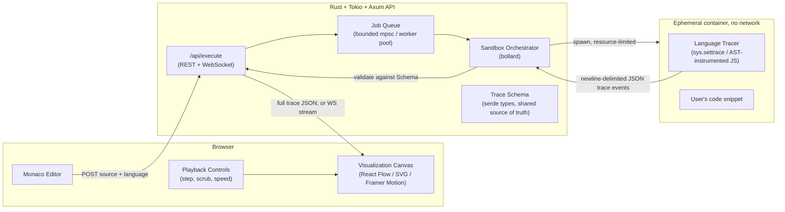

# Lattice — Blueprint

**Lattice** visualizes data structures by actually running your code inside a
sandbox and recording what happens to memory, step by step. You paste a
snippet, Lattice executes it for real, and the frontend replays the exact
sequence of variable assignments, allocations, and mutations as an animated
diagram. Because the visualization is built from a real execution trace (not
a generic simulation of "how a linked list works"), every snippet produces a
visualization that is accurate to *that specific code* — its bugs, its edge
cases, its exact control flow.

This document is both the architecture reference and the build roadmap.
Read top to bottom the first time; come back to individual sections as you
implement them.

---

## 1. Core idea: trace first, visualize second

The single most important design decision in this project is this:

> **Never let the frontend interpret source code.** The frontend only ever
> renders a sequence of *trace events* — a language-agnostic JSON record of
> what a real interpreter/runtime did. The hard, language-specific work of
> "what does this line of Python/JS actually do" is fully resolved before
> the frontend sees anything.

This gives three big wins:

1. **Correctness for free.** You don't reimplement Python/JS semantics in
   JavaScript to "simulate" execution (which always drifts from the real
   language). The real interpreter runs the code; you just watch it.
2. **Language independence.** Adding a new source language later means
   writing one new *tracer* that emits the same JSON schema. The entire
   frontend, backend API, sandbox orchestration, and visualization layer
   stay untouched.
3. **Security isolation for free.** Because "run the code" and "draw the
   picture" are different processes on different machines/containers, the
   thing that touches untrusted code never touches your rendering stack,
   your database, or the internet.

Everything else in this document exists in service of that one idea.

---

## 2. Tech stack

| Layer | Choice | Why |
|---|---|---|
| Frontend framework | **Next.js 16 (App Router) + React 19** | already scaffolded in `frontend/`; SSR for fast first paint of the editor shell, client components for the interactive visualizer |
| Frontend language | **TypeScript** | trace schema is shared/typed end-to-end (see §7) |
| Styling | **Tailwind CSS v4** | already scaffolded |
| Code editor | **Monaco Editor** (`@monaco-editor/react`) | same editor VS Code uses; free syntax highlighting, minimap, per-language modes |
| Diagram rendering | **React Flow** (node-link/graph views) + **d3-hierarchy** (tree layout) + hand-rolled SVG/Canvas components for arrays, stacks, hashmaps | node-link diagrams need real graph layout (React Flow + elkjs/dagre); linear structures don't — a plain flex/SVG row is faster and clearer |
| Animation | **Framer Motion** | smooth diffed transitions between trace steps (a node moving, a pointer re-targeting) |
| Backend framework | **Rust + Tokio + Axum 0.8** | already scaffolded in `backend/`; Axum has first-class WebSocket support for streaming trace steps |
| Serialization | **serde / serde_json** | already scaffolded; canonical trace schema lives here (§7) |
| Container/sandbox orchestration | **bollard** (async Docker Engine API client for Rust) | lets the Tokio backend spawn/kill/stream logs from sandbox containers without shelling out |
| Sandbox runtime | **Docker + gVisor (`runsc`)**, see §5 | strong syscall-level isolation with a well-trodden ops path; Firecracker microVMs as a later upgrade if isolation requirements grow |
| Job queue | **Tokio mpsc channel + bounded worker pool** (in-process) initially; **Redis + a proper queue** (e.g. via `deadpool-redis`) once you need multi-instance scaling | don't build distributed infra before you need it |
| Observability | **tracing** + **tracing-subscriber** (already scaffolded) → later **OpenTelemetry** export | structured logs from day one, minimal lift to add metrics/traces later |
| Tracer harnesses (run *inside* the sandbox, not the backend) | **Python: `sys.settrace`**, **JavaScript: Babel/SWC AST instrumentation → V8 inspector later** | see §6 |
| Persistence (Phase 3+) | **Postgres** via `sqlx`, for saved/shareable traces | not needed for MVP — traces can be fully stateless request→response |

---

## 3. System architecture



**Request lifecycle (MVP, synchronous):**

1. Browser sends `{ language, source }` to `POST /api/execute`.
2. Backend validates size/language, enqueues a job.
3. A worker pulls the job, asks the orchestrator to start a sandbox
   container for that language with the source mounted in as read-only
   input.
4. Inside the container, the language-specific **tracer harness** executes
   the user's code under instrumentation and writes one JSON object per
   step to stdout (newline-delimited JSON).
5. The orchestrator streams stdout, parses each line against the trace
   schema, enforces the step/time/output caps (§5.3), and kills the
   container the instant any cap is hit.
6. Backend returns the full array of trace steps (or streams it — see
   Phase 2) to the browser.
7. Frontend replays the steps: current step index drives what's rendered;
   moving forward/back just changes which step's heap snapshot is shown,
   with Framer Motion animating the diff between consecutive steps.

---

## 4. Repository layout

Building on what already exists:

```
Lattice/
  frontend/                     # Next.js app (exists)
    app/
      editor/                   # code input + language picker
      visualizer/               # canvas + playback controls
    components/
      viz/                      # ArrayView, LinkedListView, TreeView,
                                 # GraphView, HashMapView, StackView, …
    lib/
      trace-schema/              # TS types generated from the Rust schema (§7)
      shape-detection.ts          # heap → "this looks like a linked list" heuristics

  backend/                       # Rust + Axum API (exists)
    src/
      main.rs
      api/                       # route handlers (execute, health, ws)
      sandbox/                   # container spawn/kill/limit enforcement (bollard)
      trace/                     # canonical trace-event serde types (source of truth)
      queue/                     # job queue / worker pool

  tracers/                       # NEW — instrumentation harnesses that run
                                  # *inside* the sandbox, one per language
    python/tracer.py             # sys.settrace-based
    javascript/tracer.mjs        # Babel/SWC-instrumented

  sandbox-images/                # NEW — one minimal Dockerfile per language
    python.Dockerfile
    javascript.Dockerfile

  docs/
    BLUEPRINT.md                 # this file
```

---

## 5. Sandbox & security design

Running arbitrary user-submitted code is the single highest-risk part of
this system. Treat it as hostile by default.

### 5.1 Isolation layers (defense in depth)

| Layer | Setting |
|---|---|
| Container runtime | Docker, invoked with `--runtime=runsc` (gVisor) — intercepts syscalls in userspace, so even a container escape bug in a language runtime can't reach the host kernel directly |
| Network | `--network=none` — sandbox containers have **zero** network access, always |
| Filesystem | `--read-only` root filesystem, with a small `tmpfs` mount for scratch space, capped in size (`--tmpfs /tmp:size=16m`) |
| User | `--user 1000:1000`, never root inside the container |
| Capabilities | `--cap-drop=ALL --security-opt=no-new-privileges` |
| CPU | `--cpus=0.5` |
| Memory | `--memory=256m --memory-swap=256m` (no swap) |
| PIDs | `--pids-limit=64` — blocks fork bombs |
| Lifetime | container is created fresh per execution and destroyed immediately after — never reused, never holds state between requests |

### 5.2 Why gVisor over plain Docker or bare Firecracker (for now)

- Plain `runc` containers share the host kernel directly — a kernel exploit
  in the sandboxed process is a host compromise. Not acceptable for
  arbitrary code execution.
- Firecracker microVMs are the gold standard for isolation (each execution
  gets its own tiny VM with its own kernel) but add real operational
  weight: you need a VM image pipeline, a jailer, network setup even for
  "no network," and a lot more moving parts than an MVP needs.
- gVisor gives you *most* of the practical safety of a microVM (it
  intercepts and re-implements syscalls in userspace, so a container never
  talks to the real host kernel) while staying a one-flag change on top of
  Docker you already know. **Recommendation: ship MVP and hardened v1 on
  gVisor; revisit Firecracker only if you need multi-tenant isolation at
  serious scale (Phase 4+).**

### 5.3 Runaway-execution protection (infinite loops, huge allocations)

A resource-limited container is not enough by itself — a tight infinite
loop can still burn its full timeout before you notice, and a
multi-gigabyte-list allocation can OOM the container in a way that's messy
to report. Enforce limits at **every** layer:

1. **Inside the tracer** (cheapest, catches it earliest): the tracer itself
   keeps a step counter and raises/exits once it exceeds a cap (e.g. 5,000
   steps). This is what actually protects you from `while True: pass`.
2. **Wall-clock timeout** in the Rust orchestrator via
   `tokio::time::timeout`, independent of the tracer — if the tracer itself
   hangs (e.g. stuck in a C extension it can't instrument), the backend
   kills the whole process group after N seconds regardless.
3. **Output byte cap** — stop reading stdout and kill the container once
   trace output exceeds a size limit (protects against a step emitting a
   huge object every iteration).
4. **cgroup memory limit** (5.1) as the final backstop — if all else fails,
   the kernel OOM-kills the container, and the orchestrator reports a clean
   "memory limit exceeded" error instead of hanging.

Any of these firing should produce a **normal, user-facing error state**
("your program didn't finish in time / used too much memory"), not a
backend crash — treat hitting a limit as an expected, common case, not an
exception.

---

## 6. Language tracers

Each tracer is a small, language-native program that runs *inside* the
sandbox alongside the user's code, single-steps or hooks execution, and
emits one canonical trace event (§7) per step to stdout.

### 6.1 Python — first language, `sys.settrace`

CPython exposes a native line-level trace hook. The tracer:

- Registers a trace function via `sys.settrace`, receiving a callback on
  every line, function call, and return.
- On each callback, walks `frame.f_locals` / `frame.f_globals`, and for
  every reachable container object, assigns it a stable id (`id(obj)`) and
  serializes its shape (list → indexed elements, dict → key/value pairs,
  custom object → `__dict__`, etc.) into the heap section of the trace
  event.
- This is exactly the technique **Python Tutor** (pythontutor.com) proved
  out for over a decade — it's well understood and reliable.

Python is the first target because its reflection is native, its debug
hooks are stable across versions, and it's the language most learners
write data-structure code in.

### 6.2 JavaScript/TypeScript — second language

Two viable approaches, in order of implementation cost:

- **MVP: AST instrumentation.** Parse the source with Babel or SWC, inject
  a `__trace(lineNo, scopeSnapshot)` call after every statement, then run
  the transformed code under Node. Cheaper to build than protocol-driven
  stepping, and sufficient for straight-line and loop-heavy code, which
  covers most data-structure exercises.
- **Later: V8 Inspector Protocol.** Drive Node's built-in debugger
  (`node --inspect-brk` + CDP) to single-step and read real scope objects
  without touching the AST. More faithful for closures and async code, more
  engineering effort. Worth it once AST instrumentation's edge cases start
  showing up (e.g. generators, `async`/`await` ordering).

### 6.3 Future languages (Phase 3+)

- **Java**: JDI (Java Debug Interface) — mature, purpose-built for exactly
  this.
- **C/C++**: DWARF debug info + `lldb`/`gdb` MI-mode automation — much
  higher engineering cost (manual memory means you must interpret raw
  pointers/structs yourself), but this is where "accurate to itself"
  matters most, since pointer bugs are exactly what learners most need to
  *see*.
- **Rust**: worth watching `miri` (the reference interpreter used for UB
  detection) as a potential base — it already single-steps with full
  visibility into the memory model — but it isn't designed as a public
  tracing API today, so treat this as a research spike, not a committed
  milestone.

Every tracer, regardless of language, must obey the same contract: emit
newline-delimited JSON conforming to §7, respect the step cap from §5.3,
and never require network or filesystem access beyond its own scratch
space.

---

## 7. The trace event schema (the contract that makes this all work)

This schema is the seam between "language-specific tracer" and
"language-agnostic everything else." Define it once in Rust (`backend/src/trace/`)
as the source of truth, and generate the matching TypeScript types (via
`ts-rs` or `specta`) so frontend and backend can never drift apart silently.

```jsonc
{
  "step": 12,
  "line": 7,
  "event": "line",              // "call" | "line" | "return" | "exception"
  "function": "insert",
  "stdout_delta": "",            // any print output produced by this step
  "frames": [                    // call stack, innermost last
    {
      "function": "insert",
      "locals": {
        "node": { "ref": "obj_42" },
        "value": 3
      }
    }
  ],
  "heap": {                      // every reachable heap object, by stable id
    "obj_42": {
      "type": "ListNode",
      "fields": { "val": 3, "next": { "ref": "obj_43" } }
    },
    "obj_43": { "type": "ListNode", "fields": { "val": 7, "next": null } }
  }
}
```

Key design choices:

- **Scalars are inline, containers are references.** A field's value is
  either a literal (`3`, `"x"`, `true`) or `{ "ref": "obj_id" }`. This lets
  the frontend represent arbitrarily nested and even *cyclic* structures
  (a graph with a back-edge, a circular linked list) uniformly, without
  special-casing.
- **The heap is a full snapshot, not a diff**, at every step. Diffing is
  the *frontend's* job (comparing step N to step N-1 to decide what to
  animate) — this keeps the tracer simple and each event self-contained,
  which matters a lot if you add step-streaming or seeking later.
- **`type` field drives shape detection.** The frontend's shape-detection
  layer (§8) uses `type` plus field names as hints ("has `next`, and
  exactly one such field per node → linked list candidate") but always
  falls back to a generic node-link view, so *nothing* in the heap can ever
  fail to render, even a structure the shape-detector doesn't recognize.

---

## 8. Visualization design

Two layers on the frontend:

1. **Shape detection** (`lib/shape-detection.ts`): given a heap snapshot
   and the set of objects reachable from current locals, classify each
   connected cluster: contiguous-index object → **array**, single
   next-style chain → **linked list**, `left`/`right`-style binary
   branching → **tree**, general reference graph → **graph**, dict-like
   with no chain structure → **hashmap**, LIFO/FIFO usage pattern (harder;
   can be a v2 refinement, not required for MVP) → **stack/queue**.
2. **Renderers** (`components/viz/`): one component per detected shape,
   plus a mandatory `ObjectGraphView` fallback (a plain React Flow
   node-link diagram) for anything unclassified. This fallback is what
   guarantees the tool never just fails to draw something — worst case, you
   get an honest "here's the raw object graph" instead of a specialized
   diagram.

Rendering approach per shape:

| Shape | Renderer | Layout |
|---|---|---|
| Array / Stack / Queue | Custom SVG row of boxes | trivial, index-ordered, no layout engine needed |
| Linked list (singly/doubly/circular) | Custom SVG chain | follow the reference chain; circular lists detected via cycle check and rendered as a loop |
| Tree | `d3-hierarchy` | classic top-down tree layout |
| Graph | React Flow + `elkjs` (or `dagre`) | force/layered layout for arbitrary node-link structures |
| Hashmap | Custom grid | bucket-style key→value rows |
| Anything unrecognized | React Flow (generic) | same graph layout as above, no semantic styling |

**Playback controls**: current step is just an index into the trace array
(MVP has the *entire* trace up front — no incremental complexity needed
yet). Step forward/back, drag a scrubber, or autoplay at an adjustable
speed. Framer Motion animates each visible node/edge between the step N-1
and step N snapshots (position changes, color pulses on mutated fields,
fade in/out on alloc/dealloc).

---

## 9. API contract

**MVP (synchronous):**

```
POST /api/execute
  { "language": "python" | "javascript", "source": "<code>" }
  → 200 { "trace": [ TraceEvent, ... ], "stdout": "...", "truncated": bool }
  → 4xx { "error": "..." }              // bad input, unsupported language
  → 200 with error field                // execution error (user's code threw) —
                                          // this is a normal outcome, not an HTTP error
```

**Phase 2 (streaming):**

```
POST /api/execute        → { "job_id": "..." }
GET  /api/execute/:id     → job status (queued | running | done | failed)
WS   /api/execute/:id/ws  → server pushes TraceEvent messages as they're produced
```

Streaming matters once traces get long: instead of "wait 4 seconds, then
see everything," the user watches their program run near-live, and the
backend can cut a runaway loop off after N steps while the user has
already seen useful output — much better UX than an opaque timeout error.

---

## 10. Roadmap

Sized (S / M / L) rather than dated — attach real dates once you know your
own pace. Each phase should end with something you can actually click
through, not just code that compiles.

### Phase 0 — Foundations (S)
- [x] Next.js frontend scaffold, Rust/Axum backend scaffold (already done)
- [ ] Wire `frontend` → `backend` `/api/health` end-to-end in dev (proxy already
      referenced in backend's `main.rs` doc comment — confirm `next.config.ts`
      actually proxies `/api/*`)
- [ ] Pick and pin toolchain versions; add `rustfmt`/`clippy` and
      `eslint`/`prettier` CI checks
- [ ] Write the canonical `TraceEvent` serde types in `backend/src/trace/`
      (§7) — do this before any tracer or UI code, everything else depends
      on it

### Phase 1 — MVP: Python only, synchronous, ugly UI (M)
- [ ] `tracers/python/tracer.py` using `sys.settrace`, emitting NDJSON per §7
- [ ] `sandbox-images/python.Dockerfile` — minimal Python image, non-root user
- [ ] Backend: `sandbox/` module spawns a Docker container via `bollard`
      with the 5.1 flags, feeds in source, collects NDJSON stdout, enforces
      the 5.3 caps
- [ ] `POST /api/execute` — synchronous, returns full trace JSON
- [ ] Frontend: Monaco editor + "Run" button + a plain step viewer that
      just pretty-prints the JSON for the current step (no diagrams yet —
      prove the trace pipeline works end-to-end first)
- [ ] Golden-trace tests: a handful of known Python snippets (append to
      list, build a linked list, BFS on a small graph) with hand-verified
      expected trace output, run in CI — this is your regression suite for
      "does the tracer still tell the truth"

**Exit criteria:** paste a Python snippet that builds a linked list, hit
run, see a correct step-by-step JSON trace of every mutation. No pretty
pictures yet — this phase is entirely about proving the trace is *correct*.

### Phase 2 — Real visualization + hardened sandbox (L)
- [ ] Switch Docker runtime to `--runtime=runsc` (gVisor)
- [ ] Implement `lib/shape-detection.ts` and the renderer components (§8):
      Array, LinkedList, Tree, Graph (React Flow), HashMap, and the generic
      fallback
- [ ] Playback controls: step, scrub, autoplay/speed
- [ ] Framer Motion diff-animation between steps
- [ ] Move `/api/execute` to the async job + WebSocket streaming model (§9)
- [ ] Backend job queue (bounded Tokio worker pool) so concurrent
      executions don't starve each other
- [ ] Security test suite: attempted fork bomb, attempted network egress,
      attempted disk fill, oversized allocation — all must fail closed with
      a clean error, none should ever affect another request

**Exit criteria:** the linked-list example from Phase 1 now renders as an
actual animated node/pointer diagram you can step through.

### Phase 3 — Second language + persistence (M)
- [ ] `tracers/javascript/tracer.mjs` via Babel/SWC AST instrumentation
- [ ] `sandbox-images/javascript.Dockerfile`
- [ ] Language picker in the UI; confirm shape-detection and all renderers
      work unchanged against JS traces (this is the test of whether §7's
      language-agnostic design actually held up)
- [ ] Save/share: persist a trace + source to Postgres, generate a shareable
      URL (`/v/:id`)
- [ ] Preset snippet library (common DS&A examples) for one-click demos

### Phase 4 — Scale & polish (M/L, ongoing)
- [ ] Redis-backed job queue if running multiple backend instances
- [ ] Rate limiting per IP/session (executing code is your most expensive
      endpoint by far — protect it first)
- [ ] Metrics/tracing export (OpenTelemetry) — track sandbox spawn latency,
      queue depth, timeout/OOM rates
- [ ] Revisit Firecracker microVMs if isolation requirements or scale
      outgrow gVisor
- [ ] Additional languages (Java via JDI; C/C++ via DWARF+lldb) per §6.3
- [ ] Export a trace as a GIF/shareable video
- [ ] Embeddable widget (`<iframe>`) for blog posts/course material

---

## 11. Testing strategy

- **Tracer correctness (highest priority — this is the product):**
  golden-trace tests per language, comparing tracer output against
  hand-verified expected traces for a curated snippet library. Any tracer
  change must not silently change these without an explicit, reviewed
  schema/behavior update.
- **Sandbox security:** adversarial test suite (§Phase 2) run in CI —
  fork bombs, network attempts, disk fills, huge allocations — asserting
  they fail closed and don't affect sibling requests.
- **Schema contract:** since Rust is the source of truth and TS types are
  generated from it, add a CI check that fails if generated types are
  stale relative to the Rust definitions.
- **Frontend:** component tests for each shape renderer against fixed
  trace fixtures (not live execution — keep these fast and deterministic);
  Playwright e2e for the full "paste code → run → step through" flow.

---

## 12. Open questions to resolve early

These aren't blockers for Phase 0/1, but decide them before they're load-bearing:

- **Concurrency limits**: how many simultaneous sandbox executions does one
  backend instance allow before queuing? (Drives Phase 2 queue sizing.)
- **Step cap value**: 5,000 was used as an example in §5.3/§6 — pick a real
  number based on what "long but legitimate" data-structure demos need
  (e.g. sorting 100 elements) without leaving room for abuse.
- **Anonymous vs. authenticated usage**: Phase 3 persistence needs to
  decide if shared traces are anonymous-by-link or tied to accounts —
  affects whether you need auth infrastructure at all.
