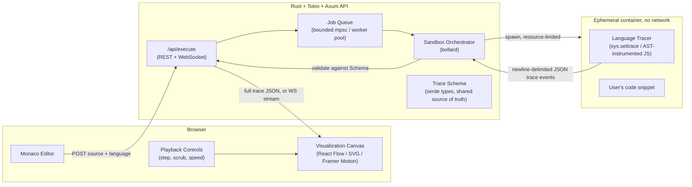
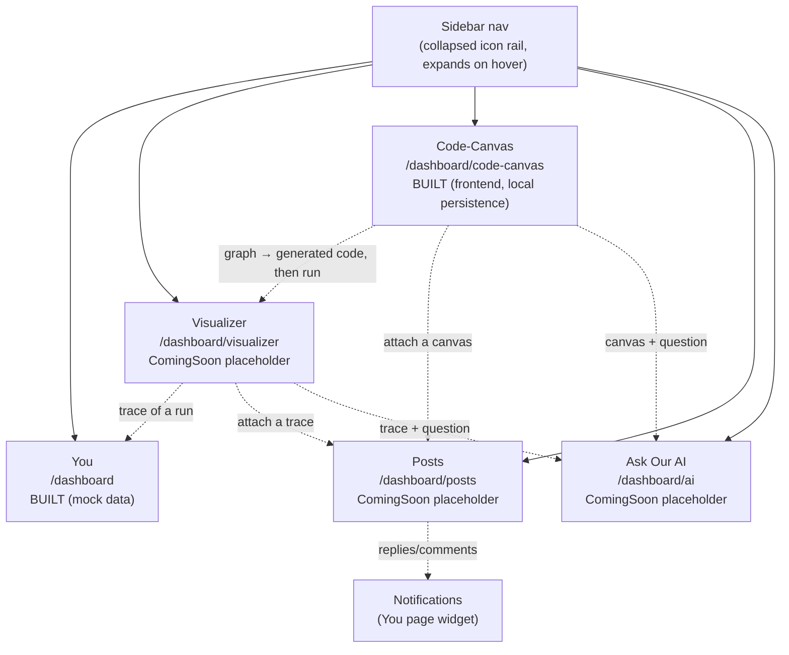
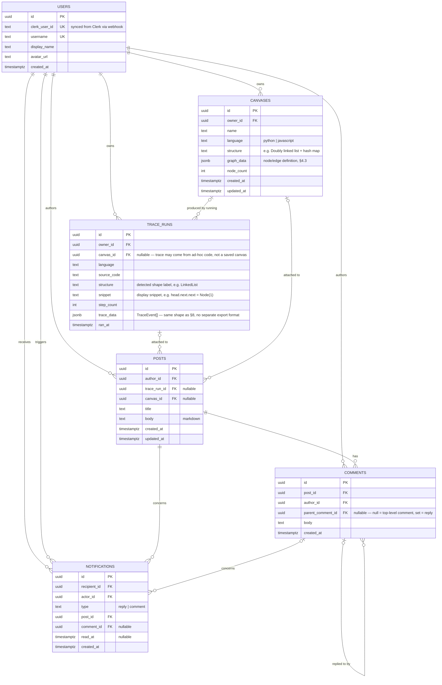

# Lattice — Blueprint

**Lattice** visualizes data structures by actually running your code inside a
sandbox and recording what happens to memory, step by step. You paste a
snippet, Lattice executes it for real, and the frontend replays the exact
sequence of variable assignments, allocations, and mutations as an animated
diagram. Because the visualization is built from a real execution trace (not
a generic simulation of "how a linked list works"), every snippet produces a
visualization that is accurate to *that specific code* — its bugs, its edge
cases, its exact control flow.

That trace engine is now one of five sections inside an authenticated
product surface — the **Workstation** (`/dashboard`, gated by Clerk) — which
also gives users a personal home, a visual node-graph code builder, a
community space for sharing traces and write-ups, and an AI assistant
grounded in the user's own trace/canvas data. §4 covers the Workstation as a
whole; §10 covers the database that the community layer (Posts) needs.

This document is both the architecture reference and the build roadmap.
Read top to bottom the first time; come back to individual sections as you
implement them.

---

## 1. Core idea: trace first, visualize second

The single most important design decision in this project is this:

> **Never let the frontend interpret source code.** The frontend only ever
> renders a sequence of *trace events* — a language-agnostic JSON record of
> what a real interpreter/runtime did. The hard, language-specific work of
> "what does this line of Python/JS actually do" is fully resolved before
> the frontend sees anything.

This gives three big wins:

1. **Correctness for free.** You don't reimplement Python/JS semantics in
   JavaScript to "simulate" execution (which always drifts from the real
   language). The real interpreter runs the code; you just watch it.
2. **Language independence.** Adding a new source language later means
   writing one new *tracer* that emits the same JSON schema. The entire
   frontend, backend API, sandbox orchestration, and visualization layer
   stay untouched.
3. **Security isolation for free.** Because "run the code" and "draw the
   picture" are different processes on different machines/containers, the
   thing that touches untrusted code never touches your rendering stack,
   your database, or the internet.

Everything else in this document exists in service of that one idea — it's
the engine behind the Workstation's **Visualizer** section (§4.2) and the
data other sections (Canvas, Posts) are built around.

---

## 2. Tech stack

| Layer | Choice | Why |
|---|---|---|
| Frontend framework | **Next.js 16 (App Router) + React 19** | already scaffolded in `frontend/`; SSR for fast first paint of the editor shell, client components for the interactive visualizer |
| Frontend language | **TypeScript** | trace schema is shared/typed end-to-end (see §8) |
| Styling | **Tailwind CSS v4** | already scaffolded |
| Auth | **Clerk** (`@clerk/nextjs`) | already scaffolded; `auth()` + `redirectToSignIn()` gate every route under `/dashboard` (`app/dashboard/layout.tsx`), `UserButton` handles account/session UI in the sidebar |
| Code editor | **Monaco Editor** (`@monaco-editor/react`) | same editor VS Code uses; free syntax highlighting, minimap, per-language modes |
| Diagram rendering | **React Flow** (node-link/graph views) + **d3-hierarchy** (tree layout) + hand-rolled SVG/Canvas components for arrays, stacks, hashmaps | node-link diagrams need real graph layout (React Flow + elkjs/dagre); linear structures don't — a plain flex/SVG row is faster and clearer; React Flow also underpins the **Canvas** node-graph builder (§4.3) |
| Animation | **Framer Motion** | smooth diffed transitions between trace steps (a node moving, a pointer re-targeting); already used for the landing page |
| Backend framework | **Rust + Tokio + Axum 0.8** | already scaffolded in `backend/` (currently just `main.rs` — everything else in this table is planned); Axum has first-class WebSocket support for streaming trace steps |
| Serialization | **serde / serde_json** | already scaffolded; canonical trace schema lives here (§8) |
| Container/sandbox orchestration | **bollard** (async Docker Engine API client for Rust) | lets the Tokio backend spawn/kill/stream logs from sandbox containers without shelling out |
| Sandbox runtime | **Docker + gVisor (`runsc`)**, see §6 | strong syscall-level isolation with a well-trodden ops path; Firecracker microVMs as a later upgrade if isolation requirements grow |
| Job queue | **Tokio mpsc channel + bounded worker pool** (in-process) initially; **Redis + a proper queue** (e.g. via `deadpool-redis`) once you need multi-instance scaling | don't build distributed infra before you need it |
| Observability | **tracing** + **tracing-subscriber** (already scaffolded) → later **OpenTelemetry** export | structured logs from day one, minimal lift to add metrics/traces later |
| Tracer harnesses (run *inside* the sandbox, not the backend) | **Python: `sys.settrace`**, **JavaScript: Babel/SWC AST instrumentation → V8 inspector later** | see §7 |
| Persistence | **Postgres** via `sqlx` | backs saved canvases and trace runs, *and* the Posts/Comments/Notifications community layer (§10) — not needed for the bare trace pipeline (§9 MVP contract is stateless), but load-bearing the moment Posts, the Canvases quick-switcher, or Recent Traces stop reading mock data |
| AI assistant | **Hermes-based agent pipeline** (§4.5) | reads the user's current trace + canvas + question together, so answers are grounded in *this* execution, not a generic textbook explanation |

---

## 3. System architecture (trace pipeline)



**Request lifecycle (MVP, synchronous):**

1. Browser sends `{ language, source }` to `POST /api/execute`.
2. Backend validates size/language, enqueues a job.
3. A worker pulls the job, asks the orchestrator to start a sandbox
   container for that language with the source mounted in as read-only
   input.
4. Inside the container, the language-specific **tracer harness** executes
   the user's code under instrumentation and writes one JSON object per
   step to stdout (newline-delimited JSON).
5. The orchestrator streams stdout, parses each line against the trace
   schema, enforces the step/time/output caps (§6.3), and kills the
   container the instant any cap is hit.
6. Backend returns the full array of trace steps (or streams it — see
   Phase 2) to the browser.
7. Frontend replays the steps: current step index drives what's rendered;
   moving forward/back just changes which step's heap snapshot is shown,
   with Framer Motion animating the diff between consecutive steps.

This diagram covers *one* section of the Workstation (the Visualizer). §4
below is the map of everything else the product now includes.

---

## 4. Product surface: the Workstation

Everything under `/dashboard` is gated by Clerk (`app/dashboard/layout.tsx`
calls `auth()` and redirects anonymous visitors to sign-in). Once inside, a
collapsible sidebar (`components/dashboard/Sidebar.tsx`) is the only
navigation — five sections, in the order they appear:



Status today: only **You** is built against real UI (still backed by mock
arrays in `lib/dashboard-data.ts`, see §10). The other four routes render
the shared `ComingSoon` component with section-specific copy — they're
placeholders that already define the product's scope, not yet its
implementation.

### 4.1 You — personal home (built)

`app/dashboard/page.tsx`. The landing screen after sign-in:

- **Stat cards** (`StatCard.tsx`) — canvases created, traces run, day streak.
- **Activity heatmap** (`ActivityHeatmap.tsx`) — GitHub-style 18-week grid,
  driven by `getActivityWeeks()`.
- **Recent traces** (`RecentTraces.tsx`) — scrollable list of the user's
  last trace runs (structure, snippet, step count, when).
- **Notifications** (`Notifications.tsx`) — replies/comments on the user's
  Posts (§4.4), the same shape as `NOTIFICATIONS` in §10's data model.
- **Canvases quick-switcher** (`CanvasesMenu.tsx`) — searchable dropdown
  over the user's saved canvases; "+ New canvas" sits next to it.
- **Music widget** (`MusicPlayer.tsx`) — local audio file playback (works
  today, purely client-side, no persistence) plus a disabled "Connect
  Spotify" stub pending OAuth credentials. This is a personal-workspace
  touch, not core to the trace/visualization product — see §13's open
  question on whether it warrants backend state at all.

All five widgets currently read static arrays from `lib/dashboard-data.ts`.
That file is the seam to replace with real API calls once §10 and §11 land.

### 4.2 Visualizer — code to diagram

`app/dashboard/visualizer/page.tsx` (currently `ComingSoon`). This is where
§1–§3's Monaco editor + trace playback UI lands — the same engine that
powers the landing page's static `CodeShowcase` demo, but interactive and
built into the authenticated workspace. Phase 1/2 of the roadmap (§12)
build this.

### 4.3 Code-Canvas — diagram to code (frontend built)

`app/dashboard/code-canvas/page.tsx`. The inverse of the Visualizer: a
free-form node-graph workspace where the user drags out nodes representing
data structures and operations, wires up connections, and Lattice
**generates real, runnable source** from that graph — which can then be fed
straight into the Visualizer's execute pipeline (§3) to trace and animate
what the generated code actually does.

The screen mirrors the Visualizer's layout: an infinite pan/zoom canvas
fills the page, a code pane docks to the right, and the same floating
header chrome sits on top. Pieces:

| File | Role |
|---|---|
| `lib/code-canvas/graph.ts` | the block catalog (`NODE_TYPES`), the graph model, port geometry, and the connection rules — one entry per block, everything else derives from it |
| `lib/code-canvas/codegen.ts` | pure `graph → C++` compiler: allocate every node, then wire, then name entry points, then run operations (allocating first is what makes cyclic graphs emit valid code) |
| `components/dashboard/code-canvas/NodeCanvas.tsx` | the canvas: dot grid, pan/zoom, node dragging, handle-to-handle wiring, edge selection |
| `components/dashboard/code-canvas/NodePalette.tsx` | the block library; drag a block out or click to drop one |
| `components/dashboard/code-canvas/CodePane.tsx` | read-only Monaco showing the generated program, plus "Visualize" (hands the code to a fresh Visualizer canvas) |
| `components/dashboard/code-canvas/Tutorial.tsx` | first-run spotlight tour, replayable from the `?` button, skippable at every step |

The node vocabulary is deliberately bounded (see §13): start pointers,
singly/doubly linked cells, binary tree nodes and graph vertices;
array/stack/queue/hashmap/variable containers; and four operations
(traverse, insert, search, print) that chain through a `then` handle to
give statement order. Arbitrary control flow stays a non-goal.

#### Backend (built)

`backend/src/code_canvas/` — graphs persist to their own `code_canvases`
table (migration `0002`), rather than the `graph_data` column on `CANVASES`
that §10.1 sketches: the shipped `canvases` table went the other way and is
now a Visualizer *workspace* (source + latest trace + resume step), so a
graph gets its own row with its own lifecycle.

| Module | Role |
|---|---|
| `code_canvas/graph.rs` | the block vocabulary the server understands — kinds, handles, and which wires between them are legal — plus structural validation |
| `code_canvas/codegen.rs` | the authoritative graph → C++ compiler |
| `code_canvas/mod.rs` | CRUD over `code_canvases`, and `visualize`'s upsert of the derived canvas |
| `api/code_canvases.rs` | the HTTP handlers, Clerk-scoped exactly like `api/canvases.rs` |

**Codegen ownership.** `codegen.rs` is the authority; the frontend's
`lib/code-canvas/codegen.ts` is a port of the same algorithm, kept only so
the code pane can update on every keystroke without a round trip. The two
must emit identical text — a change to one is a change to both. They are
checked against each other by generating the same fixture graphs through
both and diffing.

**Validation is structural, not semantic.** An unknown block kind, a wire
to a handle that doesn't exist, or a second wire on a single-connection
handle is a 400. A traverse wired to nothing is *not* — half-built graphs
are the normal state of a canvas somebody is still working on, so codegen
reports that as a note instead.

#### Derived canvases

Visualize doesn't hand code to a normal Visualizer canvas; it creates a
third kind of thing, sitting between the two pages. Such a canvas carries
`origin = 'code_canvas'` and a `code_canvas_id` back to the graph that
produced it, and:

- **Its code is read-only while it stays linked.** `PATCH` of `source_code`
  or `language` answers 409, `record_run` refuses to overwrite the stored
  source, and `/api/execute` runs *the stored source* rather than whatever
  the client posted — so the trace can only ever describe the code the
  graph actually produced. Name and `step_index` stay editable: those are
  properties of the canvas, not of the code in it.
- **A graph has at most one.** Pressing Visualize again refreshes that
  canvas in place (clearing the now-stale trace along with the source it
  described) rather than littering the Visualizer with one canvas per
  click. Unchanged source is a no-op, so the trace survives.
- **Deleting the graph detaches rather than destroys.** The FK is
  `ON DELETE SET NULL`, so the traces it produced outlive it. `origin`
  stays `'code_canvas'` — the provenance mark is permanent — but with no
  graph left to desync from, the canvas becomes editable again.

#### Frontend wiring

The page mirrors the Visualizer's routing: `/dashboard/code-canvas` is an
entry route that resumes your most recent graph (or creates one, seeded
with the worked example), and the workspace itself lives at
`/dashboard/code-canvas/[graphId]`. Graph edits autosave on a 600ms
debounce; the name is a click-to-edit pill (`CanvasNameField`, now shared
with the Visualizer). A graph left in `localStorage` by the pre-backend
build is adopted into an empty workspace once, then that key is cleared.

Visualize is a single call to `/visualize` — with a flush of any pending
edit first, since the backend compiles the *stored* graph. In the
Visualizer, a canvas with a `code_canvas_id` renders read-only, titled
"Generated code", with a "From Code-Canvas" badge linking back to the
graph, and the canvases quick-switcher badges it "Graph".

### 4.4 Posts — community write-ups

`app/dashboard/posts/page.tsx` (currently `ComingSoon`). A space for users
to publish traces, write-ups, and patterns they've found, with threaded
comments/replies and notifications back to the author — "so the next
person debugging the same linked list bug doesn't start from zero." Unlike
the Visualizer and Canvas, this section is inherently persistent (posts,
comments, and notifications all outlive a single session), which is why
§10 designs its database schema now, ahead of implementation.

### 4.5 Ask Our AI — Hermes

`app/dashboard/ai/page.tsx` (currently `ComingSoon`). An agent pipeline,
built on Hermes, that reads the user's current trace *and* canvas *and*
question together, so it can explain *why a specific pointer moved in this
run*, not recite a generic "how a linked list works" explanation. The
grounding data is exactly the `TraceEvent[]` (§8) and canvas graph (§10)
the user is already looking at — the assistant should never answer from
general knowledge about the algorithm when it has the user's actual
execution available, and should say so explicitly when neither is loaded
rather than guessing.

---

## 5. Repository layout

Reflecting what's actually built today vs. planned:

```
Lattice/
  frontend/                       # Next.js app (exists)
    app/
      layout.tsx                   # ClerkProvider, fonts, global shell
      page.tsx                     # public landing page
      dashboard/                   # the Workstation — gated by Clerk (§4)
        layout.tsx                  # auth() gate + Sidebar
        page.tsx                    # You — personal home (BUILT, §4.1)
        visualizer/page.tsx         # code → trace → diagram (ComingSoon, §4.2)
        code-canvas/page.tsx        # node-graph → code builder (BUILT, §4.3)
        posts/page.tsx              # community write-ups (ComingSoon, §4.4)
        ai/page.tsx                 # Ask Our AI / Hermes (ComingSoon, §4.5)
    components/
      landing/                     # Hero, Navbar, Features, CodeShowcase, … (public site)
      dashboard/                   # Sidebar, StatCard, ActivityHeatmap, RecentTraces,
                                    # Notifications, CanvasesMenu, MusicPlayer, ComingSoon
      viz/                         # NOT YET BUILT — ArrayView, LinkedListView, TreeView,
                                    # GraphView, HashMapView, StackView, … (§9)
    lib/
      dashboard-data.ts             # mock data behind the You page — swap for real API
                                     # calls once §10/§11 land
      clerk-appearance.ts           # Clerk theme, matched to the site's design system
      scroll-to-section.ts
      trace-schema/                 # NOT YET BUILT — TS types generated from the Rust schema (§8)
      shape-detection.ts            # NOT YET BUILT — heap → "this looks like a linked list"

  backend/                         # Rust + Axum API (exists — currently just main.rs)
    src/
      main.rs
      api/                          # NOT YET BUILT — route handlers: execute, health, ws,
                                     # posts, comments, notifications, ask (§11)
      sandbox/                      # NOT YET BUILT — container spawn/kill/limit enforcement
      trace/                        # NOT YET BUILT — canonical trace-event serde types (§8)
      queue/                        # NOT YET BUILT — job queue / worker pool
      db/                           # NOT YET BUILT — sqlx models + migrations for §10

  tracers/                         # NOT YET BUILT — one per language (§7)
    python/tracer.py                # sys.settrace-based
    javascript/tracer.mjs           # Babel/SWC-instrumented

  sandbox-images/                  # NOT YET BUILT — one minimal Dockerfile per language
    python.Dockerfile
    javascript.Dockerfile

  BLUEPRINT.md                     # this file
```

---

## 6. Sandbox & security design

Running arbitrary user-submitted code is the single highest-risk part of
this system. Treat it as hostile by default.

### 6.1 Isolation layers (defense in depth)

| Layer | Setting |
|---|---|
| Container runtime | Docker, invoked with `--runtime=runsc` (gVisor) — intercepts syscalls in userspace, so even a container escape bug in a language runtime can't reach the host kernel directly |
| Network | `--network=none` — sandbox containers have **zero** network access, always |
| Filesystem | `--read-only` root filesystem, with a small `tmpfs` mount for scratch space, capped in size (`--tmpfs /tmp:size=16m`) |
| User | `--user 1000:1000`, never root inside the container |
| Capabilities | `--cap-drop=ALL --security-opt=no-new-privileges` |
| CPU | `--cpus=0.5` |
| Memory | `--memory=256m --memory-swap=256m` (no swap) |
| PIDs | `--pids-limit=64` — blocks fork bombs |
| Lifetime | container is created fresh per execution and destroyed immediately after — never reused, never holds state between requests |

### 6.2 Why gVisor over plain Docker or bare Firecracker (for now)

- Plain `runc` containers share the host kernel directly — a kernel exploit
  in the sandboxed process is a host compromise. Not acceptable for
  arbitrary code execution.
- Firecracker microVMs are the gold standard for isolation (each execution
  gets its own tiny VM with its own kernel) but add real operational
  weight: you need a VM image pipeline, a jailer, network setup even for
  "no network," and a lot more moving parts than an MVP needs.
- gVisor gives you *most* of the practical safety of a microVM (it
  intercepts and re-implements syscalls in userspace, so a container never
  talks to the real host kernel) while staying a one-flag change on top of
  Docker you already know. **Recommendation: ship MVP and hardened v1 on
  gVisor; revisit Firecracker only if you need multi-tenant isolation at
  serious scale (Phase 4+).**

### 6.3 Runaway-execution protection (infinite loops, huge allocations)

A resource-limited container is not enough by itself — a tight infinite
loop can still burn its full timeout before you notice, and a
multi-gigabyte-list allocation can OOM the container in a way that's messy
to report. Enforce limits at **every** layer:

1. **Inside the tracer** (cheapest, catches it earliest): the tracer itself
   keeps a step counter and raises/exits once it exceeds a cap (e.g. 5,000
   steps). This is what actually protects you from `while True: pass`.
2. **Wall-clock timeout** in the Rust orchestrator via
   `tokio::time::timeout`, independent of the tracer — if the tracer itself
   hangs (e.g. stuck in a C extension it can't instrument), the backend
   kills the whole process group after N seconds regardless.
3. **Output byte cap** — stop reading stdout and kill the container once
   trace output exceeds a size limit (protects against a step emitting a
   huge object every iteration).
4. **cgroup memory limit** (6.1) as the final backstop — if all else fails,
   the kernel OOM-kills the container, and the orchestrator reports a clean
   "memory limit exceeded" error instead of hanging.

Any of these firing should produce a **normal, user-facing error state**
("your program didn't finish in time / used too much memory"), not a
backend crash — treat hitting a limit as an expected, common case, not an
exception.

---

## 7. Language tracers

Each tracer is a small, language-native program that runs *inside* the
sandbox alongside the user's code, single-steps or hooks execution, and
emits one canonical trace event (§8) per step to stdout.

### 7.1 Python — first language, `sys.settrace`

CPython exposes a native line-level trace hook. The tracer:

- Registers a trace function via `sys.settrace`, receiving a callback on
  every line, function call, and return.
- On each callback, walks `frame.f_locals` / `frame.f_globals`, and for
  every reachable container object, assigns it a stable id (`id(obj)`) and
  serializes its shape (list → indexed elements, dict → key/value pairs,
  custom object → `__dict__`, etc.) into the heap section of the trace
  event.
- This is exactly the technique **Python Tutor** (pythontutor.com) proved
  out for over a decade — it's well understood and reliable.

Python is the first target because its reflection is native, its debug
hooks are stable across versions, and it's the language most learners
write data-structure code in.

### 7.2 JavaScript/TypeScript — second language

Two viable approaches, in order of implementation cost:

- **MVP: AST instrumentation.** Parse the source with Babel or SWC, inject
  a `__trace(lineNo, scopeSnapshot)` call after every statement, then run
  the transformed code under Node. Cheaper to build than protocol-driven
  stepping, and sufficient for straight-line and loop-heavy code, which
  covers most data-structure exercises.
- **Later: V8 Inspector Protocol.** Drive Node's built-in debugger
  (`node --inspect-brk` + CDP) to single-step and read real scope objects
  without touching the AST. More faithful for closures and async code, more
  engineering effort. Worth it once AST instrumentation's edge cases start
  showing up (e.g. generators, `async`/`await` ordering).

### 7.3 Future languages (Phase 3+)

- **Java**: JDI (Java Debug Interface) — mature, purpose-built for exactly
  this.
- **C/C++**: DWARF debug info + `lldb`/`gdb` MI-mode automation — much
  higher engineering cost (manual memory means you must interpret raw
  pointers/structs yourself), but this is where "accurate to itself"
  matters most, since pointer bugs are exactly what learners most need to
  *see*.
- **Rust**: worth watching `miri` (the reference interpreter used for UB
  detection) as a potential base — it already single-steps with full
  visibility into the memory model — but it isn't designed as a public
  tracing API today, so treat this as a research spike, not a committed
  milestone.

Every tracer, regardless of language, must obey the same contract: emit
newline-delimited JSON conforming to §8, respect the step cap from §6.3,
and never require network or filesystem access beyond its own scratch
space.

---

## 8. The trace event schema (the contract that makes this all work)

This schema is the seam between "language-specific tracer" and
"language-agnostic everything else." Define it once in Rust (`backend/src/trace/`)
as the source of truth, and generate the matching TypeScript types (via
`ts-rs` or `specta`) so frontend and backend can never drift apart silently.
It also doubles as the persisted shape of a `trace_runs.trace_data` row
(§10) — a saved/shared trace is literally this same array, not a separate
export format.

```jsonc
{
  "step": 12,
  "line": 7,
  "event": "line",              // "call" | "line" | "return" | "exception"
  "function": "insert",
  "stdout_delta": "",            // any print output produced by this step
  "frames": [                    // call stack, innermost last
    {
      "function": "insert",
      "locals": {
        "node": { "ref": "obj_42" },
        "value": 3
      }
    }
  ],
  "heap": {                      // every reachable heap object, by stable id
    "obj_42": {
      "type": "ListNode",
      "fields": { "val": 3, "next": { "ref": "obj_43" } }
    },
    "obj_43": { "type": "ListNode", "fields": { "val": 7, "next": null } }
  }
}
```

Key design choices:

- **Scalars are inline, containers are references.** A field's value is
  either a literal (`3`, `"x"`, `true`) or `{ "ref": "obj_id" }`. This lets
  the frontend represent arbitrarily nested and even *cyclic* structures
  (a graph with a back-edge, a circular linked list) uniformly, without
  special-casing.
- **The heap is a full snapshot, not a diff**, at every step. Diffing is
  the *frontend's* job (comparing step N to step N-1 to decide what to
  animate) — this keeps the tracer simple and each event self-contained,
  which matters a lot if you add step-streaming or seeking later.
- **`type` field drives shape detection.** The frontend's shape-detection
  layer (§9) uses `type` plus field names as hints ("has `next`, and
  exactly one such field per node → linked list candidate") but always
  falls back to a generic node-link view, so *nothing* in the heap can ever
  fail to render, even a structure the shape-detector doesn't recognize.

---

## 9. Visualization design

Two layers on the frontend:

1. **Shape detection** (`lib/shape-detection.ts`): given a heap snapshot
   and the set of objects reachable from current locals, classify each
   connected cluster: contiguous-index object → **array**, single
   next-style chain → **linked list**, `left`/`right`-style binary
   branching → **tree**, general reference graph → **graph**, dict-like
   with no chain structure → **hashmap**, LIFO/FIFO usage pattern (harder;
   can be a v2 refinement, not required for MVP) → **stack/queue**.
2. **Renderers** (`components/viz/`): one component per detected shape,
   plus a mandatory `ObjectGraphView` fallback (a plain React Flow
   node-link diagram) for anything unclassified. This fallback is what
   guarantees the tool never just fails to draw something — worst case, you
   get an honest "here's the raw object graph" instead of a specialized
   diagram.

Rendering approach per shape:

| Shape | Renderer | Layout |
|---|---|---|
| Array / Stack / Queue | Custom SVG row of boxes | trivial, index-ordered, no layout engine needed |
| Linked list (singly/doubly/circular) | Custom SVG chain | follow the reference chain; circular lists detected via cycle check and rendered as a loop |
| Tree | `d3-hierarchy` | classic top-down tree layout |
| Graph | React Flow + `elkjs` (or `dagre`) | force/layered layout for arbitrary node-link structures |
| Hashmap | Custom grid | bucket-style key→value rows |
| Anything unrecognized | React Flow (generic) | same graph layout as above, no semantic styling |

**Playback controls**: current step is just an index into the trace array
(MVP has the *entire* trace up front — no incremental complexity needed
yet). Step forward/back, drag a scrubber, or autoplay at an adjustable
speed. Framer Motion animates each visible node/edge between the step N-1
and step N snapshots (position changes, color pulses on mutated fields,
fade in/out on alloc/dealloc).

---

## 10. Data model: Users, Canvases, Traces & Posts

Everything in this section backs the parts of the Workstation that are
inherently persistent — the You page's Recent Traces / Canvases
quick-switcher / Notifications widgets (currently mock arrays in
`lib/dashboard-data.ts`), and, primarily, **Posts** (§4.4), which cannot
exist without a database: a post, its comments, and the notifications it
generates all have to outlive the browser tab that created them.

### 10.1 Entity-relationship diagram



### 10.2 Design choices

- **`users` denormalizes Clerk identity** (`clerk_user_id`) instead of
  treating Clerk as the runtime source of truth for every query. Sync it
  via a Clerk webhook (`user.created` / `user.updated`) so Postgres foreign
  keys never depend on a live Clerk API call. This row is what every other
  table's `owner_id` / `author_id` / `recipient_id` / `actor_id` points at.
- **Comments self-reference for replies.** `parent_comment_id` is nullable
  on the same table rather than a separate `replies` table — a null parent
  is a top-level comment on a post, a non-null parent is a reply to another
  comment. This directly matches the two `NotificationItem.type` values
  already defined in `lib/dashboard-data.ts` today: `"comment"` (new
  top-level comment on your post) vs. `"reply"` (someone replied to your
  comment).
- **Posts optionally attach a trace or a canvas, not both required.** The
  Posts placeholder copy is "share traces, write-ups, and patterns" — a
  post can be pure text, or have a `trace_run_id` / `canvas_id` pointing at
  a specific execution or diagram the write-up is about. Both FKs are
  nullable and independent (a post could in principle reference both — e.g.
  "here's the canvas I built, and the trace of running it").
- **`trace_runs.trace_data` reuses the §8 schema verbatim.** A "shareable
  trace" is not a new serialization format — it's the exact `TraceEvent[]`
  array the frontend already knows how to replay, stored as `jsonb`. This
  keeps the save/share feature (Phase 3, §12) from inventing a second
  contract to keep in sync with §8.
- **`notifications` has two FKs into `users`** (`recipient_id`, `actor_id`)
  by design — every row already has to answer "who should see this" and
  "who caused this," which is exactly the `author` field the
  `Notifications.tsx` component renders today, just normalized instead of
  denormalized into a display string.
- **Indexes to add on day one** (they back the queries the You page's
  widgets already assume are cheap): `comments(post_id)`,
  `notifications(recipient_id, read_at)` for the unread-count badge,
  `trace_runs(owner_id, ran_at DESC)` for Recent Traces, and
  `canvases(owner_id, updated_at DESC)` for the Canvases quick-switcher.

---

## 11. API contract

**Trace execution — MVP (synchronous):**

```
POST /api/execute
  { "language": "python" | "javascript", "source": "<code>" }
  → 200 { "trace": [ TraceEvent, ... ], "stdout": "...", "truncated": bool }
  → 4xx { "error": "..." }              // bad input, unsupported language
  → 200 with error field                // execution error (user's code threw) —
                                          // this is a normal outcome, not an HTTP error
```

**Trace execution — Phase 2 (streaming):**

```
POST /api/execute        → { "job_id": "..." }
GET  /api/execute/:id     → job status (queued | running | done | failed)
WS   /api/execute/:id/ws  → server pushes TraceEvent messages as they're produced
```

Streaming matters once traces get long: instead of "wait 4 seconds, then
see everything," the user watches their program run near-live, and the
backend can cut a runaway loop off after N steps while the user has
already seen useful output — much better UX than an opaque timeout error.

**Community layer — Phase 3 (§10's tables, all require Clerk auth):**

```
GET    /api/posts              → paginated feed of posts (title, author, excerpt, attached trace/canvas summary)
POST   /api/posts              { title, body, trace_run_id?, canvas_id? } → created post
GET    /api/posts/:id          → post + its comment tree
POST   /api/posts/:id/comments { body, parent_comment_id? } → created comment, fans out a notification to the post/parent author
GET    /api/notifications       → current user's notifications, newest first
POST   /api/notifications/:id/read → marks one read (drives the unread badge in Notifications.tsx)
GET    /api/canvases            → current user's saved canvases (backs CanvasesMenu.tsx)
POST   /api/canvases            { name, language } → saved canvas
```

**Code-Canvas — built (§4.3):**

```
GET    /api/code-canvases                → current user's graphs, newest first (id, name, node/edge counts)
POST   /api/code-canvases                { name?, graph? } → created graph
GET    /api/code-canvases/:id            → one graph in full
PATCH  /api/code-canvases/:id            { name?, graph? } → updated graph
DELETE /api/code-canvases/:id            → 204; any derived canvas detaches rather than being deleted
POST   /api/code-canvases/:id/generate   → 200 { source, notes[] }   // compiles, persists nothing
POST   /api/code-canvases/:id/visualize  → 201 { canvas_id, outcome, source, notes[] } on first press,
                                            200 thereafter; outcome is created | refreshed | unchanged
  → 400 { "error": "..." }               // graph the server can't describe or compile
GET    /api/traces              → current user's recent trace runs (backs RecentTraces.tsx and the Activity heatmap)
```

**Ask Our AI — Phase 3.5:**

```
POST /api/ask
  { "trace_run_id"?: "...", "canvas_id"?: "...", "question": "<text>" }
  → 200 { "answer": "...", "grounded_in": ["trace_run_id" | "canvas_id"] }
  → 4xx if neither id is provided — the assistant should refuse to answer
        ungrounded rather than fall back to generic algorithm explanations
```

---

## 12. Roadmap

Sized (S / M / L) rather than dated — attach real dates once you know your
own pace. Each phase should end with something you can actually click
through, not just code that compiles.

### Phase 0 — Foundations (S)
- [x] Next.js frontend scaffold, Rust/Axum backend scaffold
- [x] Clerk auth wired: `/dashboard/*` gated via `auth()` / `redirectToSignIn()`, `UserButton` in the sidebar
- [x] Workstation shell built: collapsible `Sidebar` nav across all five sections (§4), shared `ComingSoon` placeholder component, matte design system
- [x] "You" page (§4.1) built end-to-end against mock data (`lib/dashboard-data.ts`): stat cards, activity heatmap, recent traces, notifications, canvases quick-switcher, local-file music player
- [ ] Wire `frontend` → `backend` `/api/health` end-to-end in dev (proxy already
      referenced in backend's `main.rs` doc comment — confirm `next.config.ts`
      actually proxies `/api/*`)
- [ ] Pick and pin toolchain versions; add `rustfmt`/`clippy` and
      `eslint`/`prettier` CI checks
- [ ] Write the canonical `TraceEvent` serde types in `backend/src/trace/`
      (§8) — do this before any tracer or UI code, everything else depends
      on it

### Phase 1 — MVP: Python only, synchronous, ugly UI (M)
- [ ] `tracers/python/tracer.py` using `sys.settrace`, emitting NDJSON per §8
- [ ] `sandbox-images/python.Dockerfile` — minimal Python image, non-root user
- [ ] Backend: `sandbox/` module spawns a Docker container via `bollard`
      with the 6.1 flags, feeds in source, collects NDJSON stdout, enforces
      the 6.3 caps
- [ ] `POST /api/execute` — synchronous, returns full trace JSON
- [ ] Frontend: build out `app/dashboard/visualizer/page.tsx` (§4.2),
      replacing its `ComingSoon` placeholder — Monaco editor + "Run" button
      + a plain step viewer that just pretty-prints the JSON for the
      current step (no diagrams yet — prove the trace pipeline works
      end-to-end first)
- [ ] Golden-trace tests: a handful of known Python snippets (append to
      list, build a linked list, BFS on a small graph) with hand-verified
      expected trace output, run in CI — this is your regression suite for
      "does the tracer still tell the truth"

**Exit criteria:** paste a Python snippet that builds a linked list, hit
run, see a correct step-by-step JSON trace of every mutation. No pretty
pictures yet — this phase is entirely about proving the trace is *correct*.

### Phase 2 — Real visualization + hardened sandbox (L)
- [ ] Switch Docker runtime to `--runtime=runsc` (gVisor)
- [ ] Implement `lib/shape-detection.ts` and the renderer components (§9):
      Array, LinkedList, Tree, Graph (React Flow), HashMap, and the generic
      fallback
- [ ] Playback controls: step, scrub, autoplay/speed
- [ ] Framer Motion diff-animation between steps
- [ ] Move `/api/execute` to the async job + WebSocket streaming model (§11)
- [ ] Backend job queue (bounded Tokio worker pool) so concurrent
      executions don't starve each other
- [ ] Security test suite: attempted fork bomb, attempted network egress,
      attempted disk fill, oversized allocation — all must fail closed with
      a clean error, none should ever affect another request

**Exit criteria:** the linked-list example from Phase 1 now renders as an
actual animated node/pointer diagram you can step through.

### Phase 3 — Canvas, community & persistence (L)
- [ ] Stand up Postgres + `sqlx` migrations for the §10 schema (`users`,
      `canvases`, `trace_runs`, `posts`, `comments`, `notifications`)
- [x] Canvas builder frontend (§4.3): scoped node/edge vocabulary (array,
      linked list, tree, graph, hashmap + their basic operations only — not
      general control flow, see §13), hand-rolled node editor, and a codegen
      step that turns the graph into real C++ runnable through the same
      `/api/execute` pipeline from Phase 1
- [x] Persist Code-Canvas graphs server-side: `code_canvases` table,
      Clerk-scoped CRUD, a Rust port of the graph → C++ compiler, and
      derived read-only Visualizer canvases (§4.3)
- [x] Point the Code-Canvas page at those routes (§4.3): entry route +
      `[graphId]` workspace, debounced autosave, one-call Visualize, and a
      read-only Visualizer for generated canvases
- [ ] Posts backend (§11): `POST/GET /api/posts`, comment threads with
      reply support, notification fan-out on comment/reply create
- [ ] Replace `lib/dashboard-data.ts` mock reads with real API calls across
      the You page (stat cards, activity heatmap, recent traces, canvases
      menu, notifications all currently read static arrays)
- [ ] `tracers/javascript/tracer.mjs` via Babel/SWC AST instrumentation,
      `sandbox-images/javascript.Dockerfile`, language picker in the
      Visualizer UI — confirms §9's shape-detection and renderers work
      unchanged against JS traces (the test of whether §8's
      language-agnostic design actually held up)
- [ ] Save/share: `/v/:id` shareable URL for a `trace_runs` row
- [ ] Preset snippet library (common DS&A examples) for one-click demos

### Phase 3.5 — Ask Our AI / Hermes (M)
- [ ] Design the agent pipeline (§4.5): retrieval over the current
      `trace_runs.trace_data` and/or `canvases.graph_data` plus the user's
      question, single call or small tool-use loop, answer must cite real
      step/line numbers or node ids from that specific record
- [ ] `POST /api/ask` (§11), streamed response
- [ ] Guardrail: refuse to answer when no trace/canvas is attached, rather
      than silently falling back to a generic textbook explanation — this
      is the entire value proposition over asking a general-purpose chatbot

### Phase 4 — Scale & polish (M/L, ongoing)
- [ ] Redis-backed job queue if running multiple backend instances
- [ ] Rate limiting per IP/session (executing code is your most expensive
      endpoint by far — protect it first)
- [ ] Metrics/tracing export (OpenTelemetry) — track sandbox spawn latency,
      queue depth, timeout/OOM rates
- [ ] Revisit Firecracker microVMs if isolation requirements or scale
      outgrow gVisor
- [ ] Additional languages (Java via JDI; C/C++ via DWARF+lldb) per §7.3
- [ ] Export a trace as a GIF/shareable video
- [ ] Embeddable widget (`<iframe>`) for blog posts/course material
- [ ] Spotify OAuth for the Music widget (§4.1), if still worth it by then

---

## 13. Testing strategy

- **Tracer correctness (highest priority — this is the product):**
  golden-trace tests per language, comparing tracer output against
  hand-verified expected traces for a curated snippet library. Any tracer
  change must not silently change these without an explicit, reviewed
  schema/behavior update.
- **Sandbox security:** adversarial test suite (§Phase 2) run in CI —
  fork bombs, network attempts, disk fills, huge allocations — asserting
  they fail closed and don't affect sibling requests.
- **Schema contract:** since Rust is the source of truth and TS types are
  generated from it, add a CI check that fails if generated types are
  stale relative to the Rust definitions.
- **Database migrations (§10):** run `sqlx` migrations against a throwaway
  Postgres in CI on every PR that touches `backend/src/db/`; a migration
  that doesn't apply cleanly to a fresh database should fail the build, not
  surface in staging.
- **Frontend:** component tests for each shape renderer against fixed
  trace fixtures (not live execution — keep these fast and deterministic);
  Playwright e2e for the full "paste code → run → step through" flow, and
  for the Posts flow once §11 lands ("publish a post → reply → author gets
  a notification").

---

## 14. Open questions to resolve early

These aren't blockers for Phase 0/1, but decide them before they're load-bearing:

- **Concurrency limits**: how many simultaneous sandbox executions does one
  backend instance allow before queuing? (Drives Phase 2 queue sizing.)
- **Step cap value**: 5,000 was used as an example in §6.3/§7 — pick a real
  number based on what "long but legitimate" data-structure demos need
  (e.g. sorting 100 elements) without leaving room for abuse.
- **Anonymous vs. authenticated usage**: the trace pipeline itself doesn't
  need auth, but the Workstation already gates everything behind Clerk —
  decide whether the public landing page ever gets its own "try it
  live" execute endpoint (rate-limited, unauthenticated) or whether trying
  Lattice always requires signing in first.
- **Canvas node vocabulary scope**: §4.3/§12 Phase 3 needs a hard line on
  what the graph editor can express in v1 — the risk is scope-creeping into
  "a worse visual programming language." Recommend starting with
  construction + basic mutation of the same five structures §9 already
  renders, and treating arbitrary control flow (loops, conditionals as
  graph nodes) as an explicit non-goal until there's evidence people want it.
- **Hermes grounding boundary**: does the AI ever see raw source code, or
  only the trace JSON / canvas graph? Seeing source risks it explaining
  "what the code is supposed to do" instead of "what actually happened" —
  decide this before §12 Phase 3.5, since it changes the retrieval design.
- **Notification delivery**: §11's `/api/notifications` is poll-based by
  default — decide whether Posts needs WebSocket push or email digest
  before or after the initial Phase 3 ship, since it changes the backend
  shape (a fan-out worker vs. a simple insert-on-comment).
- **Music widget scope**: the local-file player and disabled Spotify stub
  (§4.1) work without any backend today. Before giving it persistence
  (e.g. a "recently played" table), confirm it's worth product investment
  at all — it's adjacent to Lattice's core value, not part of it.
